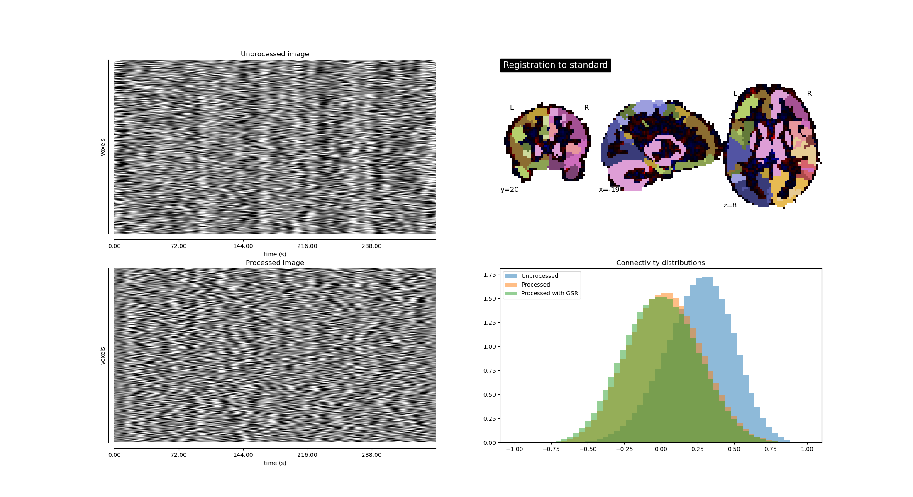

# compneuro-fmriproc
This repo conatins the fMRI preprocessing and analysis code used by the Computational Neuroimaging Lab at Biocruces Bizkaia HRI. 


## Prerequisites
### Software
All the code can be executed using docker. To build the image you need to install first [docker](https://docs.docker.com/engine/install/) and make:

```bash
sudo apt install make
```

But, if you want to install all neuroimaging software used to preprocess the data, here you have the list! 

* [ANTs](http://stnava.github.io/ANTs/)
* [AFNI](https://afni.nimh.nih.gov/)
* [FSL](https://fsl.fmrib.ox.ac.uk/fsl/fslwiki)
* [Convert3D](http://www.itksnap.org/pmwiki/pmwiki.php?n=Convert3D.Documentation)
* [Nilearn](https://nilearn.github.io/stable/index.html)

### Data structure
Raw data should be stored in [BIDS format](https://bids.neuroimaging.io/) inside a folder named "data"

Also, You need a folder with the brain extracted images and a folder with the tissue-priors segmentations. You can use our pipeline also to a better integration! [compneuro-anatpreproc](https://github.com/compneurobilbao/compneuro-anatproc). But, if you want to use another software (or your own code), you need the following folder structure and files:

```
/path/to/your/project/
├──Preproc
│   ├── Anat
│   │   ├── sub-XXX_acpc
│   │   │   ├── sub-XXX_acpc.nii.gz
│   ├── BET
│   │   ├── sub-XXX_T1w_brain.nii.gz
│   ├── ProbTissue
│   │   ├── sub-XXX_T1w_brain_corticalGM.nii.gz
│   │   ├── sub-XXX_T1w_brain_CSF.nii.gz
│   │   ├── sub-XXX_T1w_brain_subcorticalGM.nii.gz
│   │   ├── sub-XXX_T1w_brain_WM.nii.gz
```

## Getting started

First, create an environment variable where your data is placed. 

```bash
export PROJECT_PATH=/path/to/your/project
```

You can now build the docker container:

```bash
sudo make build
make dev
```

### Usage
```bash
/app/src/rsfmri_launcher.sh <physReg_technique> <movReg_technique> <task_class>
```

For the input parameter `physReg_technique` you have two options:

* **2phys**: remove the average cerebro-spinal fluid (CSF) and white matter (WM) signals
* **PCA**: remove the 5 components with greater variance explained from CSF and WM (10 components in total)


And for the parameter `movReg_technique` you have three options:

* **AROMA**: perform [ICA-AROMA](https://github.com/maartenmennes/ICA-AROMA) algorithm to calculate the movement-related components
* **6mov**: remove the 6 motion time-courses and perform scrubbing interpolating the censored volumes
* **24mov**: remove the 6 motion time-courses and its first and second derivatives, and perform scrubbing interpolating the censored volumes

By default, the volumes with a Framewise Displacement (FD) greater than 0.2 or DVAS greater than 0.5% (see https://doi.org/10.1016/j.neuroimage.2011.10.018) are marked as spureous. The final censored volumes are such marked as spureous, but also their previous volume and the two following.

`task_class` is just the name of the task you want to process, the name should be the same of the fMRI image `sub-XXX_task-<task_class>_bold.nii.gz`


## Ouputs

The main outputs will be placed in the folder `/path/to/your/project/Preproc/<task_class>_Prep_<physReg_technique>_<movReg_technique>`

Inside, you will find a subfolder for each subject where the preprocessed files are **sub-XXX_preprocessed.nii.gz** and  **sub-XXX_preprocessed_GSR.nii.gz**.

Also, in the `<task_class>_Prep_<physReg_technique>_<movReg_technique>` folder there will be a subfolder with quality checks called `QA_report`. Inside, there will be a *.csv* with different QA measures (you can use the information to discard some participants whose images has been acquired with bad quality or broad head movements) and a *.png* image for each participant as follows:


In the left side you have a carpet plot of the image before and after preprocessing and you can check if the large nuinsances has been removed. In the right side (top part) you can check if the image is well registered to the standard template and if it is well adjusted to a standard brain partition. In the right side (bottom part) are represented the functional connectivity distributions of the image with and without preprocessing to see if the inflated correlations due to movement decrease

## Cite
Please, if you want to use this code in your publications, cite this work:

**Multimodal and multidomain lesion network mapping enhances prediction of sensorimotor behavior in stroke patients**.
Antonio Jimenez-Marin, Nele De Bruyn, Jolien Gooijers, Alberto Llera, Sarah Meyer, Kaat Alaerts, Geert Verheyden, Stephan P. Swinnen, Jesus M. Cortes.
*SciRep*. 2022. doi: https://doi.org/10.1038/s41598-022-26945-x


